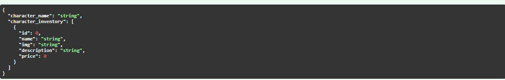

# APIs

## Maps


```json
{
  "id": 0,
  "quest_id": 0,
  "name": "string"
}
```

## Classes


```json
[
  {
    "id": 0,
    "name": "string"
  }
]
```

## Characters


```json
{
  "name": "string",
  "user_id": 0,
  "class_id": 0,
  "img_url": "string"
}
```


```json

Response body
Download
{
  "id": 1,
  "user_id": 1,
  "name": "string",
  "class_id": {
    "id": 1,
    "name": "Dog"
  },
  "img_url": "string",
  "quest_id": 1,
  "health": 5,
  "currency": 0
}
```

---


```json
[
  {
    "id": 0,
    "user_id": 0,
    "name": "string",
    "class_id": {
      "id": 0,
      "name": "string"
    },
    "img_url": "string",
    "quest_id": 0,
    "health": 0,
    "currency": 0
  }
]
```

---


```json
{
  "id": 0,
  "user_id": 0,
  "name": "string",
  "class_id": {
    "id": 0,
    "name": "string"
  },
  "img_url": "string",
  "quest_id": 0,
  "health": 0,
  "currency": 0
}
```

---


```json
{
  "id": 0,
  "user_id": 0,
  "name": "string",
  "class_id": {
    "id": 0,
    "name": "string"
  },
  "img_url": "string",
  "quest_id": 0,
  "health": 0,
  "currency": 0
}
```

---


```json
true
```

## Questions


```json
{
  "id": 0,
  "question": "string",
  "answer": "string",
  "option_1": "string",
  "option_2": "string",
  "option_3": "string"
}
```

## Shop


```json
true
```

## Inventory


```json
{
  "character_name": "string",
  "character_inventory": [
    {
      "id": 0,
      "name": "string",
      "img": "string",
      "description": "string",
      "price": 0
    }
  ],
  "character_id": 0,
  "user_id": 0,
  "class_id": {
    "id": 0,
    "name": "string"
  },
  "img_url": "string",
  "quest_id": {
    "id": 0,
    "name": "string",
    "questions": {
      "id": 0,
      "question": "string",
      "option_1": "string",
      "option_2": "string",
      "option_3": "string"
    },
    "reward": 0,
    "instructor": {
      "id": 0,
      "name": "string",
      "quote": "string"
    }
  },
  "health": 0,
  "currency": 0
}
```



```json
{
  "character_name": "string",
  "character_inventory": [
    {
      "id": 0,
      "name": "string",
      "img": "string",
      "description": "string",
      "price": 0
    }
  ]
}
```
