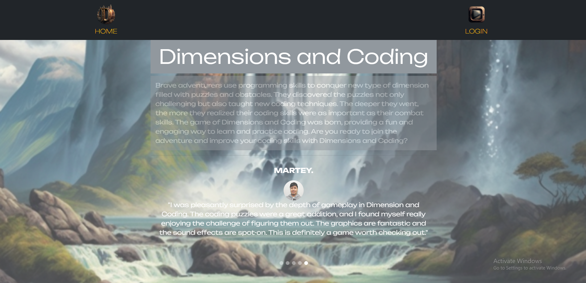
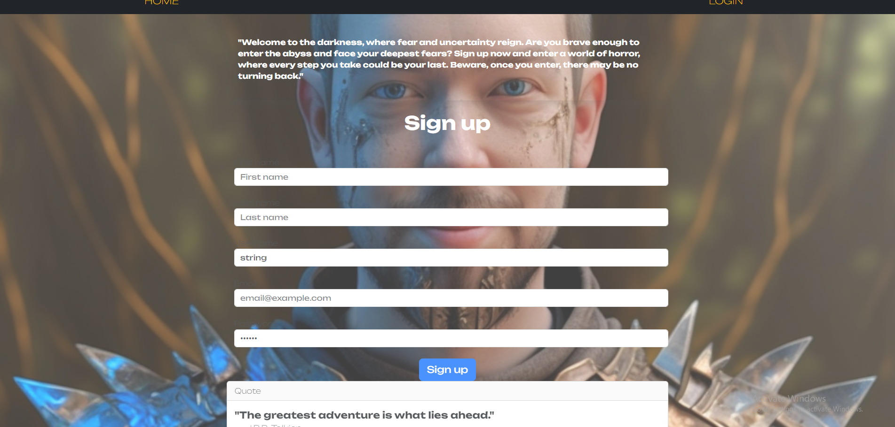
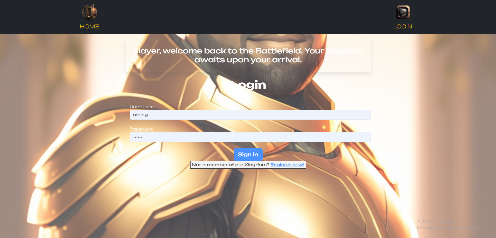
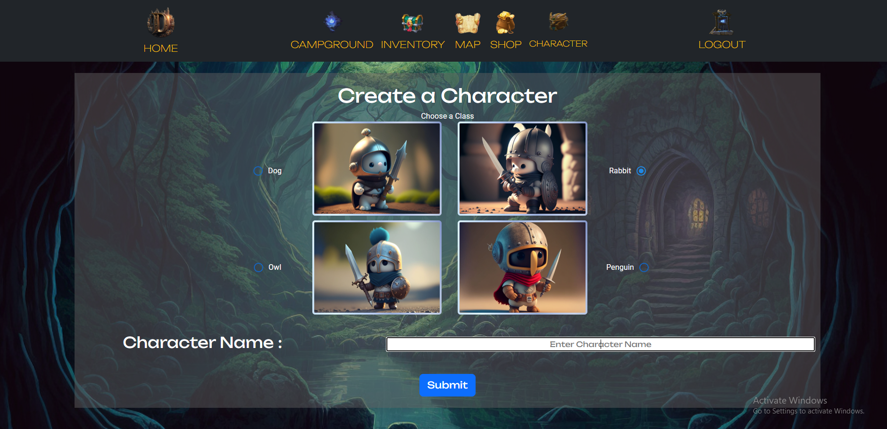
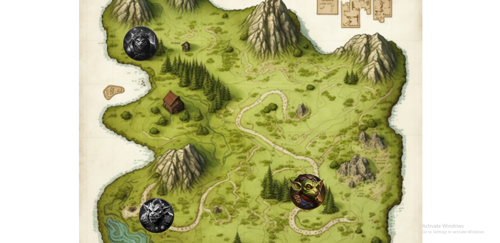
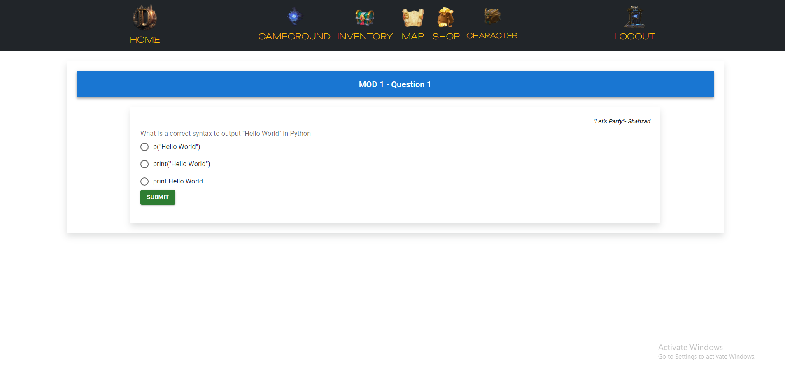
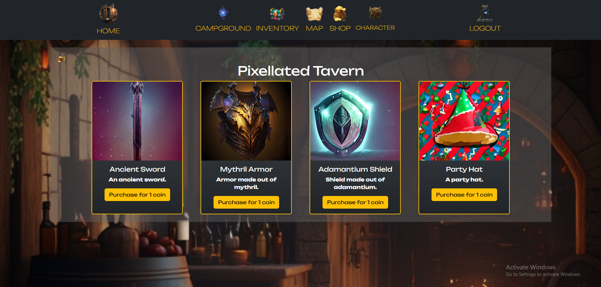

# Graphical Human Interface

## Landing Page

The Home Page

## Register

A user registration form that allows users to create new accounts

## Login

A user log-in form that prompts for account information.

## Character Creation

## Character Select

This was intended to be the first page the user would see after signing up. User has a choice of different character types and inputs a character username.

## Campground

This page displays can be considered as the hub as it contains links to all of our features: shop, quest, map, character details

## Map

The map displays each encounter, which would be represented by a monster or marker. The player would be routed to the encounters page upon clicking one of these markers and prompted to solve a coding challenge.

## Coding Challenge

## Shop

In this shop, we would display items that would allow the player spend their currency, which they received as a reward after completing each coding challenge

