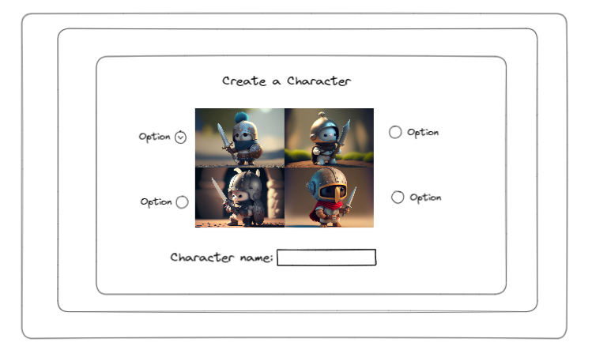
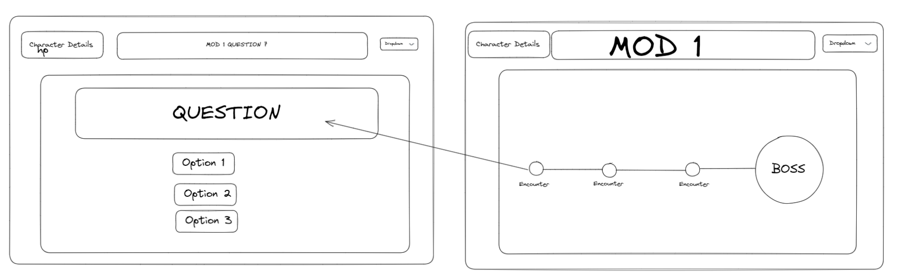
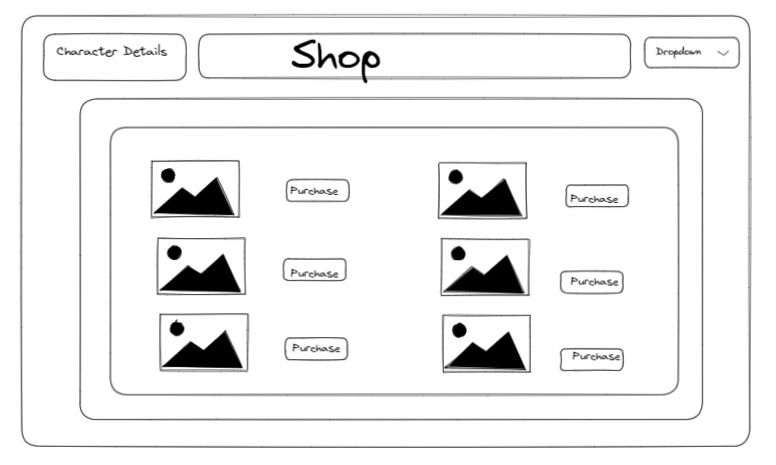
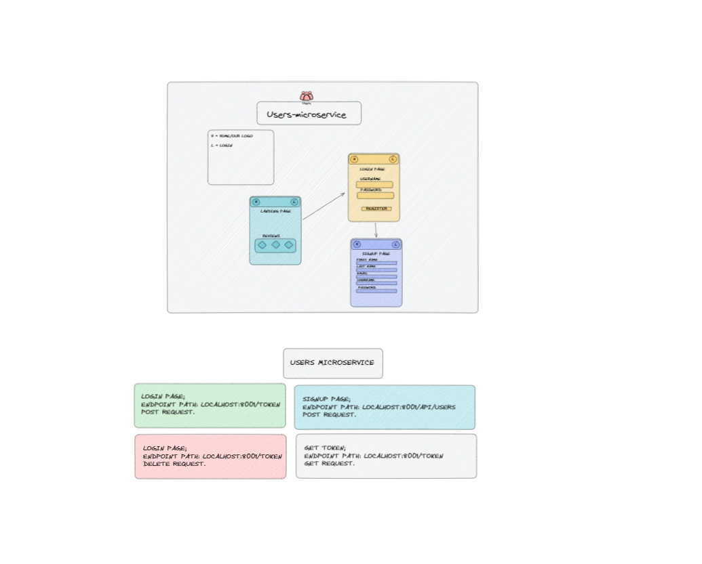

# Wireframe Diagrams

These are the diagrams of the interface created during the conception of the project.

## Character Select Page

This was intended to be the first page the user would see after signing up. User has a choice of different character types and inputs a character username.

## Hub Page

This page displays can be considered as the hub as it contains links to all of our features: shop, quest, map, character details

## Maps & Encounters Page

The map displays each encounter, which would be represented by a monster or marker. The player would be routed to the encounters page upon clicking one of these markers and prompted to solve a coding challenge.

## Shop Page

In this shop, we would display items that would allow the player spend their currency, which they received as a reward after completing each coding challenge

## User Microservice Diagram

